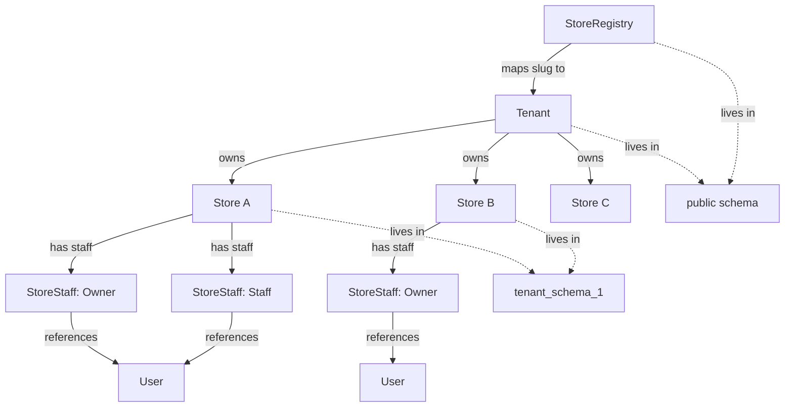

# Agent Context

**This is the most important document in the repository.** Every AI coding agent and new developer should read this before writing any code.

---

## Project Vision

Algoie is a multi-tenant ecommerce SaaS platform. A single business (Tenant) owns multiple Stores. Each Store can have its own products, orders, customers, and staff.

### Long-term Goals

- A self-serve platform where merchants create a store in minutes
- Subdomain-based storefronts (e.g., `nike.algoie.com`)
- AI-assisted store management
- Multi-channel sales (online, POS, messaging)

### MVP Philosophy

Build incrementally. Each day establishes a foundation layer. Later layers depend on earlier ones but never modify their core contracts. If an earlier decision proves wrong, the architecture is updated to reflect reality — the documentation is the source of truth, not the original plan.

### Scope (Current)

Day 1 is complete. The foundation includes: multi-tenancy, store hierarchy, authentication, authorization, provisioning, and routing.

Out of scope for now: products, inventory, orders, customers, POS, messaging, AI agent, storefront.

---

## Tech Stack

| Technology | Role | Why Chosen |
|-----------|------|-----------|
| **Elixir** | Primary language | OTP concurrency, fault tolerance, excellent for real-time systems |
| **Phoenix** | Web framework | Battle-tested, excellent LiveView support, strong ecosystem |
| **Ash Framework** | Domain modeling | Declarative resources, built-in policies, actions, and data layer abstraction |
| **AshPostgres** | PostgreSQL adapter | Schema-per-tenant multitenancy, migration generation, lifecycle hooks |
| **PostgreSQL** | Database | Schema isolation for multi-tenancy, JSON support, full-text search capability |
| **AshAuthentication** | Authentication | Password strategy, JWT tokens, integrates natively with Ash resources |
| **Tailwind CSS** | Styling | Utility-first CSS, rapid UI development |
| **Bandit** | HTTP server | Modern, performant HTTP server for Phoenix |

---

## Core Architecture

### Key Relationships

- **One Tenant owns many Stores.** The Tenant is the business entity. Stores are the operational units.
- **Tenant context represents the PostgreSQL schema.** When you set `tenant: "tenant_<uuid>"`, Ash queries that schema.
- **Store permissions are independent from tenant routing.** A user can be staff of Store A but not Store B, even though both belong to the same tenant. Access is controlled by StoreStaff records, not by tenant context.

### The Two Contexts

Every request that touches a store sets two values in the Ash context:

| Context Key | Set By | Purpose | Example Value |
|------------|--------|---------|---------------|
| `tenant` | StoreSlugPlug | Postgres schema routing | `"tenant_abc123"` |
| `store_id` | StoreSlugPlug | Store-level authorization | `"store-uuid"` |

The `tenant` value routes queries to the correct Postgres schema. The `store_id` value is used by policy checks to determine if the actor has access to that specific store. These are independent concerns — you can be in the right tenant but not have access to a specific store.

---

## Current Status

### Day 1 — Complete ✓

**Implemented:**
- Ash domains (Accounts, Stores)
- All domain resources (Tenant, User, Token, Store, StoreRegistry, StoreStaff)
- Ash policies (ActorIsSystem, ActorHasStoreAccess, ActorHasAnyStoreAccess, ActorIsRecordOwner)
- Authentication foundation (password strategy, token infrastructure)
- Tenant provisioning (Tenant + schema + migrations + default Store + owner User + StoreStaff)
- Subdomain routing (StoreSlugPlug)
- StoreRegistry for slug→tenant resolution
- Verification script (14/14 checks passing)

**Not implemented:**
- Products, inventory, orders, customers
- POS, messaging, AI agent
- Storefront
- Custom domain SSL
- Dynamic RBAC

---

## Important Decisions

### Why Schema Multitenancy

Each tenant gets a dedicated Postgres schema. This provides strong data isolation — no query can accidentally cross tenant boundaries. The tradeoff is operational complexity (more schemas to manage), but for a SaaS platform, the isolation guarantee is worth it.

See [ADR/001-schema-multitenancy.md](ADR/001-schema-multitenancy.md).

### Why StoreRegistry Exists

StoreRegistry is a public-schema table that maps slugs to tenant IDs. It exists because tenant schemas are isolated — you can't query across schemas to find a store by slug. The registry provides a cross-tenant lookup point for subdomain routing.

See [ADR/002-store-registry.md](ADR/002-store-registry.md).

### Why StoreStaff is Internal

StoreStaff is a join table between Users and Stores. It has intentionally permissive `always()` policies because:
1. Schema-level isolation already handles tenant separation
2. Parent Store policies handle access control
3. Exposing it directly would create circular authorization issues

The `@moduledoc` warning documents this. If StoreStaff becomes API-facing, the policies must be replaced.

See [ADR/003-storestaff-internal.md](ADR/003-storestaff-internal.md).

### Why Schema Names Are the Tenant Context

AshPostgres's `context` strategy uses the tenant value directly as the Postgres schema name via `Ecto.Query.put_query_prefix/2`. Passing a raw UUID would fail because the schema is named `"tenant_<uuid>"`, not just the UUID.

See [ADR/001-schema-multitenancy.md](ADR/001-schema-multitenancy.md).

### Why Store Policies Are the Authorization Boundary

Store policies control who can read, update, and destroy stores. StoreStaff's `always()` policies delegate this responsibility to the parent resource. This avoids circular authorization (StoreStaff policy checking StoreStaff to authorize Store operations).

### Why `after_action` is Used

The Store create action uses `after_action` to create the StoreRegistry entry. This ensures the registry entry is only created if the Store creation succeeds, and runs within the same transaction.

### Why `cascade_destroy` is Used

Store's destroy action uses `cascade_destroy(:staff_memberships, after_action?: false)` to delete StoreStaff records before the Store. This avoids needing deferrable foreign key constraints.

### Why Ash Conventions Are Preferred

Ash provides a declarative approach to resources, policies, and actions. Custom code is used only where Ash has no built-in support (e.g., StoreRegistry operations that need to bypass tenant context propagation).

---

## Coding Principles

1. **Follow Ash conventions.** Use Ash resources, actions, and policies. Avoid custom Ecto schemas when Ash resources suffice.
2. **Prefer framework features.** Ash provides multitenancy, policies, lifecycle hooks, and data layer abstraction. Use them.
3. **Avoid custom SQL unless necessary.** Raw SQL is used only for StoreRegistry operations (to bypass tenant context) and policy checks (to avoid circular authorization).
4. **Business logic belongs in resources.** Actions, changes, and policies live on the resource, not in separate context modules.
5. **No premature optimization.** Ash handles query optimization. Profile before optimizing.
6. **Never change architecture without updating documentation.** If the implementation differs from the plan, update the docs to match reality.
7. **If Ash recommends a different approach, follow Ash.** The framework's conventions are battle-tested. When Ash and the original plan conflict, Ash wins.

---

## Rules for Future AI Agents

1. **Read AGENT_CONTEXT.md and ARCHITECTURE.md before coding.** Understand the architecture before making changes.
2. **Don't refactor working code.** Only change code when there's a clear bug or a documented improvement.
3. **Keep implementation aligned with architecture.** If you change behavior, update the docs.
4. **If Ash recommends a different approach than the original design, update the documentation.** The docs are the source of truth.
5. **Explain architectural decisions.** When you make a non-trivial change, document why.
6. **Run `mix precommit` before committing.** This catches formatting, compilation, and test issues.
7. **Don't add dependencies without justification.** Every dependency is a maintenance burden.

---

## Known Limitations

| Limitation | Reason | Status |
|-----------|--------|--------|
| StoreStaff uses `always()` policies | Internal resource; schema isolation handles tenant separation | Intentional — see ADR/003 |
| JWT tokens disabled | Day 1 focuses on foundation; tokens are Day 2 work | Planned for Day 2 |
| Dynamic RBAC postponed | Requires product/order domain first | Future phase |
| Storefront not implemented | Depends on product catalog | Future phase |
| No soft deletes | Hard deletes with cascade; soft deletes are Day 2+ work | Future phase |
| No audit logging | Observability layer comes after core features | Future phase |
| Token signing secret hardcoded in config | Tokens are disabled; will be moved to env vars in Day 2 | Planned for Day 2 |

---

## Next Milestone: Day 2

Day 2 builds on the Day 1 foundation. The planned scope includes:

- **Product catalog:** Products, categories, variants, images
- **Inventory management:** Stock tracking, low-stock alerts
- **Basic storefront:** Public product browsing per store
- **JWT token configuration:** Enable tokens with proper secret management
- **Staff management APIs:** Expose StoreStaff with proper authorization

See [ROADMAP.md](ROADMAP.md) for the full roadmap.
