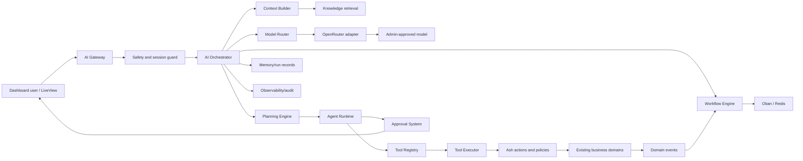
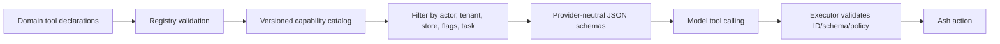
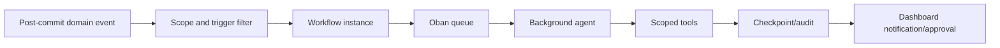

# AI Platform Architecture (MVP)

This adds an AI platform capability to Algoie. It does not redesign Phoenix, LiveView, Ash domains/actions/policies, PostgreSQL tenancy, Redis, or Oban.

The MVP is a supervised digital employee: one bounded agent, OpenRouter managed by SaaS admins, action-backed tools, durable approvals/audit records, and Oban background work. Its contracts support later multimodal and multi-agent expansion without changing business domains.

## Principles

- Ash actions are the only business interface. AI never accesses ecommerce data through Repo, SQL, Ecto queries, or arbitrary endpoints.
- A run acts as the requesting dashboard user. Existing Ash policies, validations, team roles, tenant schema and store access remain authoritative.
- Actor, tenant schema ("tenant_<uuid>") and store ID are derived server-side and mandatory for every run.
- A model may call only registered, typed capability contracts; it cannot choose arbitrary resources, actions, fields, queries or URLs.
- SaaS admins centrally configure encrypted OpenRouter credentials, allowed models/profiles, budgets and kill switches. Store users cannot access keys or choose arbitrary models.
- Destructive, financial, external, bulk, publish and send actions require human approval.
- All material decisions are auditable.

## 1. Subsystem Architecture



| Component | MVP responsibility | Evolution |
|---|---|---|
| AI Gateway | Authenticated LiveView/API entry, streaming status, scope binding, rate limits | API/chat channels |
| Orchestrator | Durable run state, context/model/tool loop, stopping rules, explanation | Specialist-agent routing |
| Agent Runtime | Executes bounded plan, checkpoints | Sandboxed parallel read-only specialists |
| Tool Registry | Validated action-backed catalog | Versioned capability packages |
| Model Router | Chooses an allowed OpenRouter profile | Other gateway/provider adapters |
| Knowledge/Memory | Scoped retrieval, approved facts/preferences | Hybrid/per-agent retrieval |
| Workflow Engine | Durable plans, waits, approvals and retries via Oban | Reusable event workflows |
| Safety/Audit | Injection defense, redaction, approval, trace | DLP/evaluations/anomaly detection |

The AI platform may persist its own runs, approvals, memories and indexes in dedicated AI resources. “No direct PostgreSQL” prohibits bypassing Ash for business capabilities/ecommerce data; AI-owned persistence should also use Ash resources where practical.

## 2. Ash Integration and Tool Registry

Each existing module retains its resource, action, policy and validation design. It adds a small declarative adapter beside the owning domain:

```elixir
defmodule Algoie.Catalogue.AITools.UpdateProduct do
  use Algoie.AI.Tool,
    id: "catalogue.product.update",
    version: 1,
    action: {Algoie.Catalogue.Product, :update},
    risk: :approval_required,
    permissions: [:manage_products],
    input: ProductUpdateInput,
    output: ProductSummary,
    idempotency: :supported
end
```

A declaration provides stable ID/version, Ash resource/action, typed JSON input/output, role capability, risk, tenant/store scope, max batch size, retry/idempotency policy, confirmation text and redaction rules. CI/boot validation rejects missing actions, unsafe schemas or missing risk.

ToolExecutor receives only registry IDs and schema-valid arguments and invokes:

```elixir
actor: run.actor,
tenant: run.tenant_schema,
context: %{store_id: run.store_id, ai_run_id: run.id},
authorize?: true
```

Ash still evaluates authorization and business validations. Results are compact structured summaries and permitted record IDs/deep links, never unrestricted table dumps.



Only eligible tools are exposed to the model. Future modules need Ash actions plus tested declarations; no AI-core change. Initial groups: read (lookup/report), draft (unpublished copy/report/image), scoped write (product/inventory), external effect (email/publish/coupon), and destructive/bulk (delete/refund/mass changes). Default approval increases with risk.

## 3. Agent Execution Lifecycle

```mermaid
sequenceDiagram
  participant User as Dashboard user
  participant Gate as AI Gateway
  participant Orch as Orchestrator
  participant Reg as Tool Registry
  participant Model as OpenRouter
  participant Tool as Tool Executor
  participant Ash as Ash Domain
  participant Approval as Approval UI
  User->>Gate: Instruction + current store
  Gate->>Gate: Authenticate; derive actor/tenant/store; rate limit
  Gate->>Orch: Create durable run
  Orch->>Reg: Eligible scoped tools
  Orch->>Model: Context + policies + filtered tools
  Model-->>Orch: Plan/tool call
  Orch->>Tool: Validated call
  Tool->>Ash: Action with actor/tenant/store; authorize?
  Ash-->>Tool: Result or denied/error
  Tool-->>Orch: Redacted result + audit reference
  Orch->>Model: Tool result
  Model-->>Orch: Next step/final answer
  alt Approval required
    Orch->>Approval: Persist normalized action and preview
    Approval-->>User: Confirmation request
    User->>Approval: Approve/reject
    Approval->>Orch: Resume only if valid
  end
  Orch-->>Gate: Explanation + run ID
  Gate-->>User: Streamed result
```

Run states: queued, building_context, planning, awaiting_model, executing_tool, awaiting_approval, scheduled, completed, failed, cancelled and expired. Cap steps, wall time, tool calls, output tokens, cost and retries. Checkpoint before side effects. Cancellation prevents subsequent tools, not completed Ash actions.

MVP uses one orchestrator agent. Add catalogue, operations, marketing or analytics specialists only after evaluation proves a gain; each receives the same narrowed scope and tools, never a privileged shared token.

## 4. Context, Knowledge and Memory

Build context just-in-time under a fixed budget:

1. Immutable tool-only and safety instructions.
2. Derived actor role/capabilities, tenant/store, locale/timezone and flags.
3. Conversation summary and latest request.
4. ACL-filtered RAG chunks, carrying source/version/freshness.
5. Compact dashboard facts acquired using read tools.
6. Filtered schemas and plan checkpoint.

Never inject entire dashboards, reports, documents or transcripts. Summarize and cite source IDs; read tools fetch exact values. OCR, websites, emails, retrieved text and tool text are untrusted data, not instructions.

| Tier | Contents | Scope |
|---|---|---|
| Run | plan, outputs, approvals, summary | encrypted, short-lived run |
| Conversation | summaries/preferences | user + tenant + store; editable/deletable |
| Business facts | approved voice/policies | tenant/store, owner-managed/versioned |
| Knowledge | docs, FAQs, product material | document ACL + tenant/store |
| Analytics | aggregated recommendations | tenant/store; no raw cross-tenant data |

Ingestion: upload → malware/type/size checks → OCR/document extraction → chunking → embedding adapter → scoped index → review/publish. Each chunk includes tenant, optional store, ACL, source version and deletion status. Filters apply before vector/reranking.

## 5. OpenRouter Model Routing and Cost

Implement OpenRouterAdapter behind a provider-neutral ModelClient behaviour. SaaS-admin configuration holds encrypted credential, endpoint, enabled model IDs, logical profiles, default/fallback profiles, platform budgets and kill switch. Only server code reads the credential. Stores can choose only approved profiles.

| Profile | Use | Rule |
|---|---|---|
| fast_chat | chat/classification/simple drafts | low-cost default |
| tool_reasoning | multi-step plans/function calls | structured output and tool limits |
| vision | uploaded image/OCR fallback | explicit consent and limits |
| creative | descriptions/marketing | drafts only |
| premium_review | difficult analysis | opt-in admin budget |

The router chooses the cheapest healthy approved profile satisfying tools/structured output/vision/context requirements. Enforce per-run/tenant/platform budgets, token/media limits, semantic caching only for safe reads, prompt trimming, request coalescing and approved-model fallbacks. Persist profile/model, token/media use, latency, fallback reason and estimated cost. Never silently upgrade cost after a budget breach.

Image generation/editing, video, speech, OCR, browser and research are provider-neutral adapters; keep them disabled until approved providers, content policy, egress allow-list, quota and retention exist.

## 6. Workflow, Events and Background Work

A workflow is a versioned durable DAG/state machine of plan, tool, approval, wait, notify and compensate nodes. It coordinates work, not business rules; effects remain Ash actions.



Publish normalized post-commit events such as inventory.low_stock, order.created, order.status_changed, product.updated, report.ready and customer.repeat_order_detected. Payloads carry IDs/scope, never broad records; runs fetch detail through read tools. Use an outbox/durable equivalent so an event is not lost after business success.

Separate Oban queues: ai_interactive, ai_workflow, ai_ingest, ai_media and ai_maintenance. Include scope, run ID, idempotency/correlation ID and approval expiry. Use tenant fair-use, unique jobs, bounded retries, dead-letter review and per-tool concurrency. Redis is for rate limits, ephemeral streams/sessions and cache; durable truth is PostgreSQL.

MVP background work is recommendation-only: low-stock summaries, weekly report drafts, repeat-order opportunities and ingestion. It cannot message customers or write business data without routed approval.

## 7. Security, Approval and Audit

Approval is durable signed intent—not chat text. It binds run, actor, tenant/store, tool ID/version, normalized arguments, preview, risk reason, expiry and one-time nonce. Any changed arguments, scope, tool version, target or actor privilege invalidates it. Re-authorize immediately before execution.

| Risk | Examples | Behaviour |
|---|---|---|
| read_only | lookup/analysis | execute after authorization |
| draft | copy/report/image proposal | execute unpublished |
| write | individual product/inventory change | preview + confirmation by default |
| external_effect | send email/publish/customer communication | always confirm |
| destructive_or_financial | delete/refund/cancel/bulk update | always confirm, batch preview, optional two-person rule |

Also: derive scope at the gateway; filter before model exposure and authorize in Ash again; enforce schemas/ID formats/batches/idempotency/timeouts/circuit breakers/concurrency; isolate prompt-injection sources; scan uploads and use private signed storage URLs; make research/browser opt-in, egress allow-listed and unauthenticated as the dashboard user; redact PII/secrets from prompts/telemetry; provide kill switches by platform, tenant, capability, model and workflow.

Propagate OpenTelemetry Phoenix request → run → OpenRouter → tool → Ash → Oban. Track outcomes, policy blocks, tool errors, approval latency, queue age, retrieval quality, latency/tokens/cost and fallbacks. Keep append-only AI audit events linked to business audit trails. The run timeline shows request, sources, plan, calls, policy/approval, record links, profile and rationale. Retain encrypted/redacted raw prompt/output separately and briefly; audit records retain hashes/references.

## 8. Deployment and Folder Structure

Deploy in the existing OTP release for MVP: Phoenix serves the gateway, supervised runtime processes perform short runs, Oban performs durable work, Redis handles ephemeral coordination, PostgreSQL holds AI-owned state, and OpenRouterAdapter is the only model egress. Split media/ingestion workers first, then autoscale the runtime as a trusted separate OTP deployment sharing code, queues, state and telemetry.

```text
lib/algoie/
  ai/
    gateway.ex
    orchestrator.ex
    run.ex
    approval.ex
    audit_event.ex
    tool.ex
    tool_registry.ex
    tool_executor.ex
    context_builder.ex
    planner.ex
    workflow.ex
    memory/{conversation,business_fact,retrieval}.ex
    knowledge/{document,ingest,retriever}.ex
    models/{client,router,openrouter_adapter,configuration}.ex
    safety/{policy,redaction,prompt_guard}.ex
    workers/{run_worker,ingest_worker,scheduled_workflow_worker}.ex
  catalogue/ai_tools/
  inventory/ai_tools/
  orders/ai_tools/
  marketing/ai_tools/
lib/algoie_web/live/ai/
  assistant_live.ex
  run_component.ex
  approvals_live.ex
  admin_configuration_live.ex
```

Use actual domain names. Domain-local ai_tools keep tool/action tests together; Algoie.AI remains generic.

## 9. Extension Strategy and Roadmap

Accounting, CRM, POS, Warehouse, Procurement, Supplier, HRM, Payroll, Marketplace, portals, Manufacturing, BI and Marketing Automation each add only:

1. named Ash reads/actions with existing policy/validation;
2. typed tool declarations with risk/scope/idempotency/output;
3. normalized post-commit events;
4. ACL-bound knowledge sources when documents exist;
5. tool, policy, approval and workflow tests.

No orchestrator change is required. AI access is explicit: a module is not exposed merely because it exists. Cross-domain requests are plans of individually authorized tools, never cross-domain database queries.

Recommended patterns: hexagonal ports/adapters; capability registry instead of generic CRUD; command/query separation; state machine plus saga compensation through business actions; outbox/event consumer; policy enforcement at gateway/executor with Ash as decision authority; and strangler evolution from one agent to specialists.

- Phase 0: AI resources/state machine, SaaS-admin OpenRouter config, router/adapter, telemetry/rate limits/kill switch, registry/executor and scope tests.
- Phase 1: streamed chat; catalogue/inventory/orders/reports read tools; content drafts; timeline/citations; approvals; hard budgets; one tool model plus fallback.
- Phase 2: selected scoped writes, email/coupon approvals, OCR/RAG, weekly drafts, Oban workflows and injection/permission/tool accuracy evaluations.
- Phase 3: image/vision adapters, opted-in research, then specialists where measurement justifies complexity. Video/browser remain separately controlled packages.

The MVP deliberately favors one agent over a swarm, and confirmation over convenience. OpenRouter speeds provider choice but adds dependency/privacy concerns; mitigate using allow-lists, fallback profiles, budgets and kill switches. RAG is useful but can be stale/injection-prone, so source/version/ACL/citations are mandatory.

## Acceptance Criteria

An authorized staff member can analyze scoped store data and draft content; permitted multi-step work uses only registered Ash tools; consequential work shows a precise approval preview; and the audit proves actor/tenant/store, tools, Ash outcomes, OpenRouter profile/cost and final explanation. Direct data access, privilege escalation, cross-tenant retrieval, unregistered calls and approval reuse fail closed.

