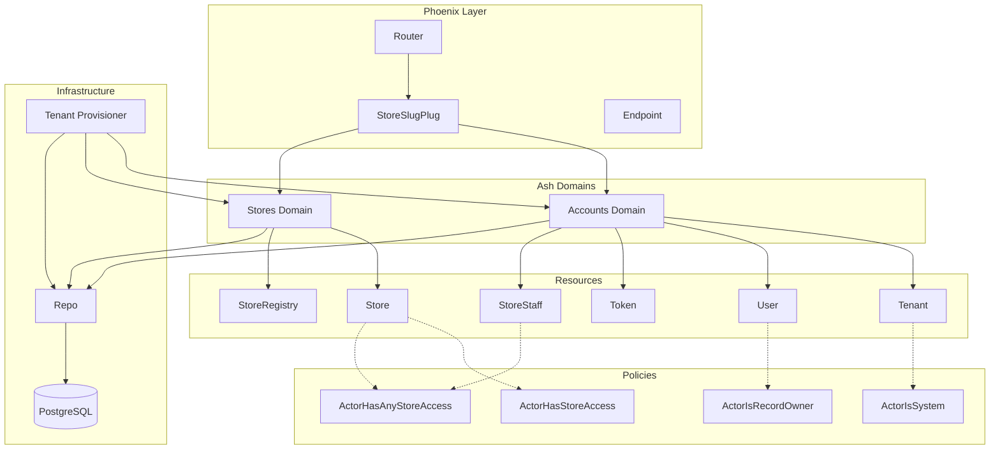
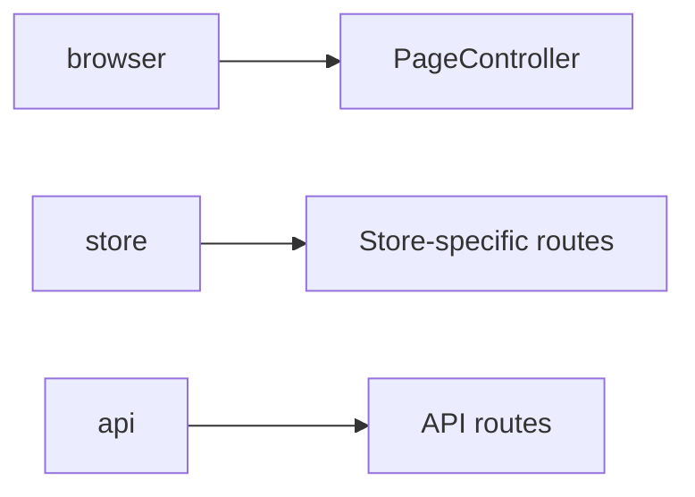
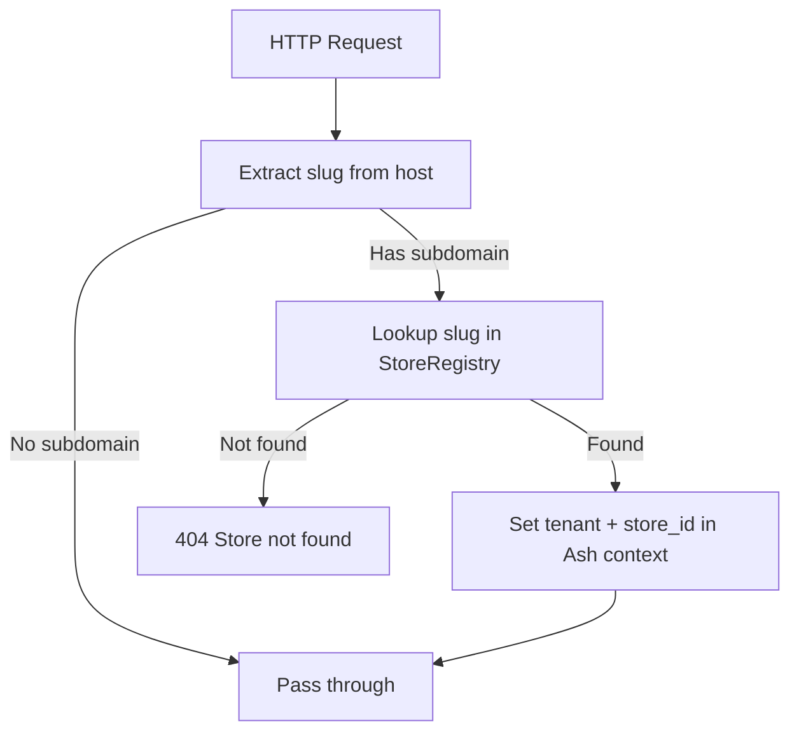
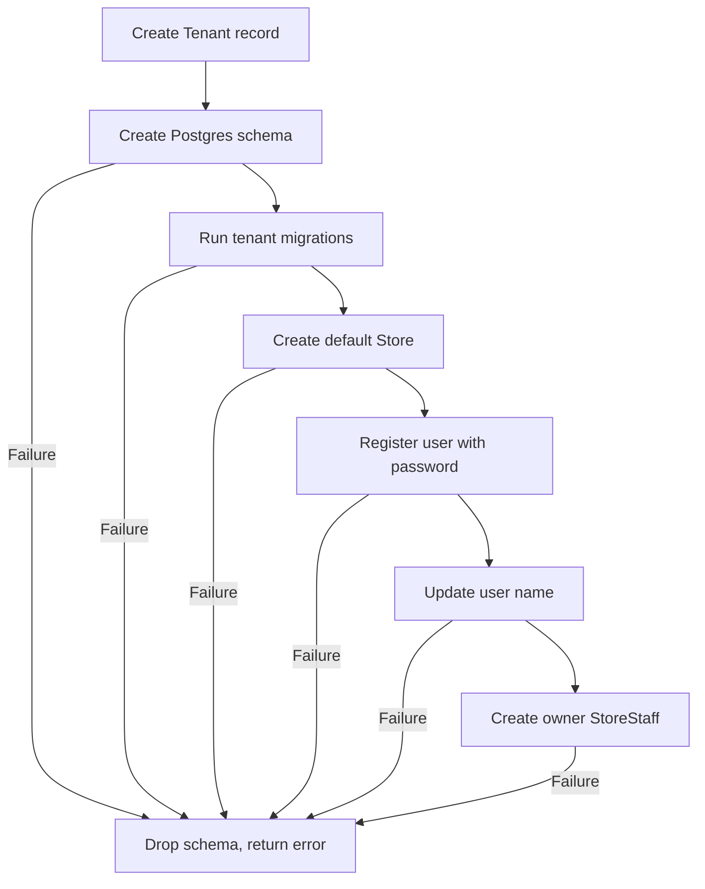
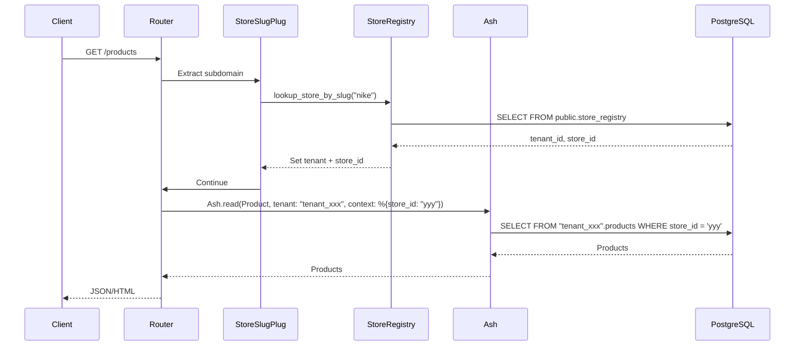

# Architecture

Deep architectural reference for the Algoie platform. This document describes every component, its purpose, and how components interact.

---

## Project Architecture



---

## Domain Architecture

### Accounts Domain (`Algoie.Accounts`)

Manages tenants, users, authentication tokens, and store staff memberships.

| Resource | Table | Schema | Purpose |
|----------|-------|--------|---------|
| Tenant | `tenants` | `public` | Business/account entity. Owns stores. |
| User | `users` | `tenant_<uuid>` | Authenticated person. Can belong to multiple stores. |
| Token | `tokens` | `public` | AshAuthentication JWT token storage. |
| StoreStaff | `store_staff` | `tenant_<uuid>` | Join table linking Users to Stores with a role. |

### Stores Domain (`Algoie.Stores`)

Manages stores and the cross-tenant store registry.

| Resource | Table | Schema | Purpose |
|----------|-------|--------|---------|
| Store | `stores` | `tenant_<uuid>` | An operational unit within a tenant. |
| StoreRegistry | `store_registry` | `public` | Maps slugs to tenant IDs for subdomain routing. |

---

## Phoenix Layer

### Router (`AlgoieWeb.Router`)

Three pipelines:



- **browser**: Standard HTML pipeline (session, CSRF, live flash)
- **store**: Browser pipeline + `StoreSlugPlug` for subdomain resolution
- **api**: JSON pipeline for API routes

### StoreSlugPlug (`AlgoieWeb.Plugs.StoreSlugPlug`)

Resolves `store-slug.algoie.com` → Store by slug → sets Ash tenant context.



The plug extracts the subdomain from the host, looks it up in StoreRegistry (public schema), and sets two values in the Ash context:
- `tenant:` — the schema name for query routing
- `store_id:` — the store UUID for policy checks

---

## Resources

### Tenant (`Algoie.Accounts.Tenant`)

The business entity. Lives in the `public` schema because it has no tenant context — it IS the tenant.

```elixir
# No multitenancy block — Tenant lives in public schema
postgres do
  table("tenants")
  repo(Algoie.Repo)
  schema("public")
end
```

**Attributes:** id (UUID), name, owner_email (ci_string), billing_status (trial/active/suspended)

**Policies:** Only `:system` actor can create/read/update/destroy.

### User (`Algoie.Accounts.User`)

Authenticated person. Lives in tenant schemas. Uses AshAuthentication for password strategy.

```elixir
multitenancy do
  strategy(:context)
end
```

**Attributes:** id (UUID), email (ci_string, public), hashed_password (sensitive), name (optional)

**Policies:** `:system` can create. `ActorIsRecordOwner` can read/update their own record.

### Store (`Algoie.Stores.Store`)

Operational unit within a tenant. Lives in tenant schemas.

**Attributes:** id (UUID), name, slug (unique within tenant), custom_domain, status (active/inactive)

**Key behavior:** The create action uses `after_action` to create a StoreRegistry entry. The destroy action uses `cascade_destroy` to delete StoreStaff before the Store.

**Policies:** Read/update require `ActorHasAnyStoreAccess` OR `ActorHasStoreAccess(level: :staff)`. Destroy requires `ActorHasStoreAccess(level: :owner)`.

### StoreStaff (`Algoie.Accounts.StoreStaff`)

Internal join table. See [AGENT_CONTEXT.md](AGENT_CONTEXT.md#why-storestaff-is-internal) for why it uses `always()` policies.

### StoreRegistry (`Algoie.Stores.StoreRegistry`)

Public-schema table for cross-tenant slug lookup. Not an Ash-managed resource for writes — created/deleted via Ecto directly to bypass tenant context propagation.

---

## Authentication

### Password Strategy

Configured on the User resource via AshAuthentication:

```elixir
password :password do
  identity_field(:email)
  hashed_password_field(:hashed_password)
  confirmation_required?(false)
  sign_in_tokens_enabled?(false)
  register_action_accept([:name])
end
```

- `register_action_accept([:name])` extends the auto-generated register action to accept the `name` field
- `confirmation_required?(false)` — no password confirmation needed for MVP
- `sign_in_tokens_enabled?(false)` — tokens disabled until Day 2

### Token Strategy

Tokens are configured but disabled (`enabled?: false`). When re-enabled in Day 2:
- Move `token_signing_secret` from compile-time config to runtime environment variable
- Configure JWT signing via AshAuthentication

### Session Handling

`session_identifier(:unsafe)` is used because tokens are disabled. This will change when JWT tokens are enabled.

---

## Authorization

### Policy Architecture

```mermaid
graph TD
    subgraph "Store Policies"
        SC[create: ActorIsSystem]
        SR[read/update: ActorIsSystem | ActorHasAnyStoreAccess | ActorHasStoreAccess:staff]
        SD[destroy: ActorIsSystem | ActorHasStoreAccess:owner]
    end
    
    subgraph "StoreStaff Policies"
        SSC[create: ActorIsSystem]
        SSR[read: always]
        SSD[update/destroy: always]
    end
    
    subgraph "User Policies"
        UC[create: ActorIsSystem]
        UR[read/update: ActorIsSystem | ActorIsRecordOwner]
    end
    
    subgraph "Tenant Policies"
        TC[create/read/update/destroy: ActorIsSystem]
    end
```

### Policy Checks

| Check | Module | Purpose |
|-------|--------|---------|
| `ActorIsSystem` | `Algoie.Policies.Checks.ActorIsSystem` | Actor is `:system` atom |
| `ActorHasStoreAccess` | `Algoie.Policies.Checks.ActorHasStoreAccess` | Actor has specific role on specific store |
| `ActorHasAnyStoreAccess` | `Algoie.Policies.Checks.ActorHasAnyStoreAccess` | Actor has any StoreStaff membership in tenant |
| `ActorIsRecordOwner` | `Algoie.Policies.Checks.ActorIsRecordOwner` | Actor is the record being accessed (User self-access) |

### Circular Authorization Prevention

`ActorHasStoreAccess` uses `Ash.read_one(..., authorize?: false)` to query StoreStaff without triggering StoreStaff's own policies. `ActorHasAnyStoreAccess` uses raw SQL for the same reason.

---

## Tenant Provisioning

### `Algoie.Tenants.Provisioner.create_tenant_with_setup/1`



**Why schema creation is outside the transaction:** Postgres DDL (CREATE SCHEMA) cannot run inside an Ecto transaction in a way that allows rollback. The schema and migrations commit immediately. Resource creation (Store, User, StoreStaff) happens after and can fail individually.

**Rollback:** If resource creation fails, `drop_tenant_schema` is called to clean up the orphaned schema.

---

## Routing

### Subdomain Resolution

```mermaid
flowchart LR
    Host[nike.algoie.com] --> Extract[Extract "nike"]
    Extract --> Registry[StoreRegistry lookup]
    Registry -->|Found| SetCtx[Set tenant + store_id]
    Registry -->|Not found| 404[404]
```

The plug uses `String.replace_suffix` to extract the subdomain. The domain is configurable via `APP_DOMAIN` environment variable (defaults to `localhost`).

---

## Store Registry

StoreRegistry bridges the gap between public-schema routing and tenant-schema data. It lives in the `public` schema and stores the mapping: `slug → tenant_id + store_id`.

### Why Ecto Instead of Ash

StoreRegistry operations use Ecto directly (with `prefix: "public"`) because Ash's tenant context propagation would route these operations to the wrong schema. The Store's `after_action` hook calls `Algoie.Stores.create_registry_entry/1` which bypasses Ash entirely.

---

## Schema Isolation

Each tenant gets a dedicated Postgres schema named `tenant_<uuid>`. All tenant-scoped resources (Store, User, StoreStaff) live in this schema. Ash Postgres enforces this via `Ecto.Query.put_query_prefix/2`.

The Tenant resource and StoreRegistry live in the `public` schema because they must be accessible cross-tenant.

---

## Data Flow

### Request Flow



### Provisioning Flow

See [Tenant Provisioning](#tenant-provisioning) section above.

---

## Lifecycle

### Store Lifecycle

1. **Created:** Store record + StoreRegistry entry (via after_action)
2. **Active:** Can be read, updated by authorized users
3. **Destroyed:** StoreStaff cascade-deleted, then Store + StoreRegistry entry removed

### Tenant Lifecycle

1. **Provisioned:** Tenant record + schema + migrations + default Store + owner User + StoreStaff
2. **Active:** All stores operational
3. **Deletion:** Not yet implemented (future phase)
