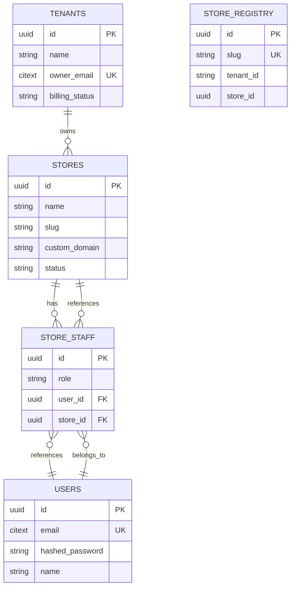
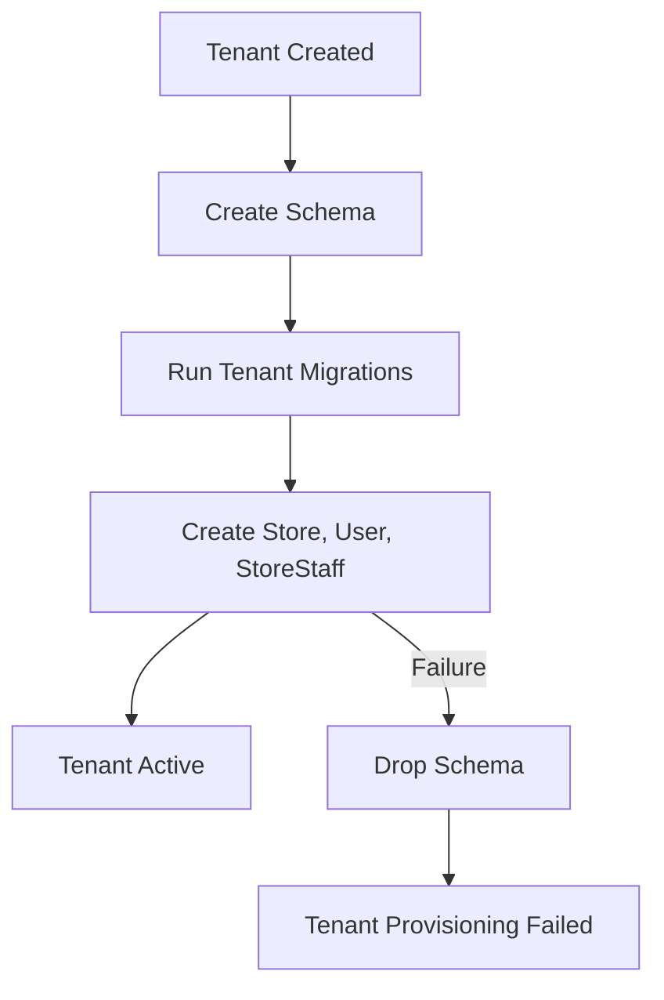

# Database

Schema design, tables, relationships, and migration strategy. For resource-level behavior, see [ARCHITECTURE.md](ARCHITECTURE.md).

---

## Schemas

### Public Schema

Contains cross-tenant tables that all tenants can access.

| Table | Purpose |
|-------|---------|
| `tenants` | Business/account entities |
| `store_registry` | Slug → tenant mapping for subdomain routing |
| `tokens` | AshAuthentication JWT token storage |

### Tenant Schemas

Named `tenant_<uuid>`. Each tenant gets a dedicated schema.

| Table | Purpose |
|-------|---------|
| `users` | Authenticated people |
| `stores` | Operational units within a tenant |
| `store_staff` | Join table linking users to stores with roles |

---

## Tables

### tenants (public)

```
tenants
├── id: uuid (PK)
├── name: text NOT NULL
├── owner_email: citext NOT NULL (unique)
├── billing_status: text NOT NULL DEFAULT 'trial'
├── inserted_at: utc_datetime_usec
└── updated_at: utc_datetime_usec
```

### store_registry (public)

```
store_registry
├── id: uuid (PK)
├── slug: text NOT NULL (unique)
├── tenant_id: text NOT NULL
├── store_id: uuid NOT NULL
└── inserted_at: utc_datetime_usec
```

### tokens (public)

```
tokens
├── jti: text (PK)
├── purpose: text NOT NULL
├── subject: text NOT NULL
├── expires_at: utc_datetime
├── extra_data: map
├── created_at: utc_datetime_usec
└── updated_at: utc_datetime_usec
```

### users (tenant)

```
users
├── id: uuid (PK)
├── email: citext NOT NULL (unique)
├── hashed_password: text NOT NULL
├── name: text (nullable)
├── inserted_at: utc_datetime_usec
└── updated_at: utc_datetime_usec
```

### stores (tenant)

```
stores
├── id: uuid (PK)
├── name: text NOT NULL
├── slug: text NOT NULL (unique within tenant)
├── custom_domain: text (nullable)
├── status: text NOT NULL DEFAULT 'active'
├── inserted_at: utc_datetime_usec
└── updated_at: utc_datetime_usec
```

### store_staff (tenant)

```
store_staff
├── id: uuid (PK)
├── role: text NOT NULL ('owner' | 'staff')
├── user_id: uuid FK→users.id NOT NULL
├── store_id: uuid FK→stores.id NOT NULL
├── inserted_at: utc_datetime_usec
└── updated_at: utc_datetime_usec
```

---

## Relationships



---

## Constraints

| Table | Constraint | Type |
|-------|-----------|------|
| tenants | `owner_email` unique | Unique index |
| store_registry | `slug` unique | Unique index |
| stores | `slug` unique (within tenant) | Unique index |
| users | `email` unique (within tenant) | Unique index |
| store_staff | `(user_id, store_id)` unique | Composite unique index |
| store_staff | `user_id` FK→users | Foreign key |
| store_staff | `store_id` FK→stores | Foreign key |

---

## Indexes

| Table | Columns | Purpose |
|-------|---------|---------|
| tenants | `owner_email` | Fast lookup by owner email |
| store_registry | `slug` | Fast subdomain resolution |
| stores | `slug` | Unique constraint (within tenant) |
| users | `email` | Unique constraint (within tenant) |
| store_staff | `(user_id, store_id)` | Unique constraint + lookup |

---

## Migration Strategy

### Public Schema Migrations

Located in `priv/repo/migrations/`. Run via `mix ash.migrate`.

### Tenant Schema Migrations

Located in `priv/repo/tenant_migrations/`. Run per-tenant during provisioning.

The `Provisioner` runs `Ecto.Migrator.run` with `prefix: schema_name` to apply migrations to the correct tenant schema.

### Future Migrations

When new resources are added:
1. Generate migrations with `mix ash.codegen`
2. Add tenant migrations to `priv/repo/tenant_migrations/`
3. Update the `Provisioner` to run new migrations for existing tenants
4. Consider a migration runner for existing tenants (currently not implemented)

---

## Schema Lifecycle



Schema deletion is not yet implemented. When it is, it should:
1. Drop the tenant schema with `CASCADE`
2. Remove the Tenant record from the public schema
3. Remove StoreRegistry entries

---

## See Also

- [ARCHITECTURE.md](ARCHITECTURE.md) — Resource behavior and provisioning flow
- [ADR/001](ADR/001-schema-multitenancy.md) — Schema-based multi-tenancy decision
- [ADR/002](ADR/002-store-registry.md) — StoreRegistry decision
