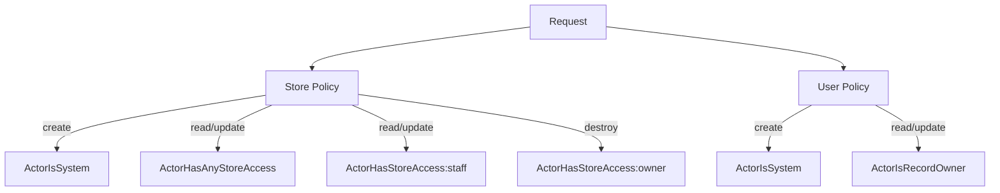

# Security

Authentication, authorization, isolation, and threat model. For resource-level policy details, see [ARCHITECTURE.md](ARCHITECTURE.md).

---

## Authentication

### Current: Password Strategy

AshAuthentication's password strategy handles registration and sign-in. Passwords are hashed with bcrypt (via `bcrypt_elixir`).

- `confirmation_required?(false)` — no password confirmation for MVP
- `sign_in_tokens_enabled?(false)` — tokens disabled until Day 2
- `session_identifier(:unsafe)` — session management deferred to Day 2

### Future: JWT Tokens

When tokens are enabled:
- Move `token_signing_secret` to a runtime environment variable
- Configure JWT signing via AshAuthentication
- Implement proper session handling with token refresh

---

## Authorization

### Policy Layers

### Principle of Least Privilege

- Store creation: Only `:system` (provisioning)
- Store read/update: Any user with a StoreStaff membership in the tenant
- Store destroy: Only users with `:owner` role on the specific store
- User creation: Only `:system` (provisioning)
- User read/update: Only the user themselves or `:system`

---

## Tenant Isolation

Each tenant's data lives in a dedicated Postgres schema. This provides:

1. **No cross-tenant queries:** A query in `tenant_a` cannot see `tenant_b` data.
2. **No accidental data leakage:** Even with bugs in application code, the schema boundary prevents cross-tenant access.
3. **Independent schema management:** Each tenant's schema can be migrated independently.

---

## Store Isolation

Store access is controlled by StoreStaff records:

1. **ActorHasStoreAccess:** Looks up the StoreStaff record for `(actor.id, store_id)` and checks the role.
2. **ActorHasAnyStoreAccess:** Checks if the actor has any StoreStaff membership in the tenant.
3. **ActorIsSystem:** Always returns true for the `:system` actor.

The Store policy uses `authorize_if` chains — any matching check grants access.

---

## Secrets

| Secret | Location | Status |
|--------|----------|--------|
| `token_signing_secret` | `config/config.exs` | Hardcoded (tokens disabled) |
| `secret_key_base` | `config/dev.exs` | Hardcoded for dev |
| `DATABASE_PASSWORD` | `config/dev.exs` | Hardcoded for dev |

**Production requirement:** Move all secrets to environment variables before deployment.

---

## Threat Model

### Mitigated

- Cross-tenant data leakage (schema isolation)
- Unauthorized store access (StoreStaff policies)
- Unauthorized user modification (ActorIsRecordOwner)
- SQL injection (mitigated by Ecto parameterized queries)
- CSRF (mitigated by Phoenix's `protect_from_forgery`)

### Not Yet Mitigated

- Token theft (JWT not yet enabled)
- Session fixation (session handling deferred)
- Rate limiting on auth endpoints
- Brute force on registration (rate limiting TBD)

---

## Security Checklist

Before deployment:
- [ ] All secrets moved to environment variables
- [ ] JWT tokens enabled with proper secret management
- [ ] Rate limiting on authentication endpoints
- [ ] Session handling updated from `:unsafe`
- [ ] CORS configured for API endpoints
- [ ] HTTPS enforced in production

---

## See Also

- [ARCHITECTURE.md](ARCHITECTURE.md) — Policy architecture and checks
- [ADR/004](ADR/004-authorization-model.md) — Authorization model decision
- [ADR/003](ADR/003-storestaff-internal.md) — StoreStaff internal resource decision
